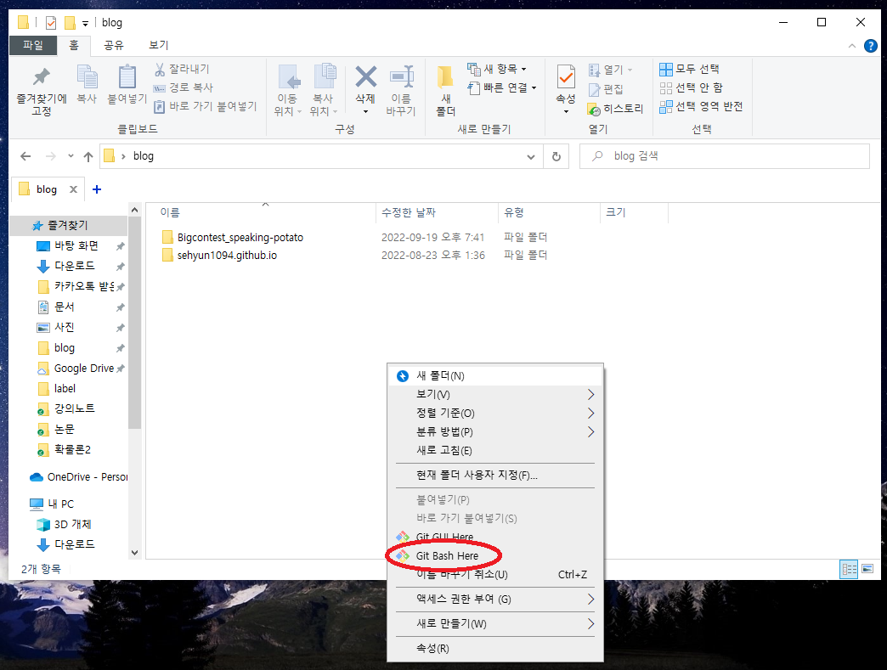

# Bigcontest_speaking-potato

> Git 초기 설정
- 명령 프롬프트를 통하여 다음 코드를 실행
```
git config --global user.name [사용자 이름]
git config --global user.email [사용자 이메일]
```

<br>  


> github 블로그 업데이트 방법  

0. 처음 실행하는 경우 blog 폴더에서 마우스 오른쪽 클릭 후 [Git Bash Here]을 실행  
  

이후 다음을 실행  

```
git clone [repo 주소]
```   

**위 과정은 한 번만 진행하고 이후에는 할 필요가 없다**  

<br>  

1. Git Bash에서 blog 업데이트 할 폴더 위치로 이동(cd) 후 pull을 실행하여 데이터를 가져온다.  
```
cd Bigcontest_speaking-potato
```  

```
git pull
```  

- 파일 수정 후 다음을 실행
```
git add .
git commit -m "메세지"
git push origin main
```

<br>  

> LF will be replaced by CRLF in 오류  
- 다음 코드를 실행
```python
# Windows, Dos
git config --global core.autocrlf false
git config --global core.autocrlf true

# Linux, Mac
git config --global core.autocrlf input
```

---
Powered By [Hydejack-Starter-Kit](https://github.com/hydecorp/hydejack-starter-kit)
